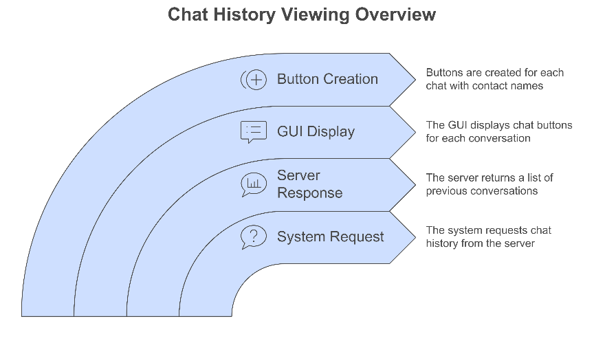

Comprehensive Guide: Bob and Alice's Chat Journey

## Initial Setup and Login Phase

### Scenario 1: First-time Launch

When Bob launches the application:

1. The application shows a logo screen (`start_logo()`)

2. Any key press triggers `clear_screen()` which transitions to the login interface

3. The GUI displays:

- Username field

- Password field

- Sign in button

- Sign up option

```python

def start_logo(self):

Label(self.master, image=self.master.img, bg='white').place(x=250, y=50)

heading = Label(self.master, text='InstaLink', fg='#7703fc', bg='white',

font=('Microsoft YaHei UI Light', 30, 'bold'))

heading.place(x=375, y=5)

self.master.bind("<Key>", self.clear_screen)

```


### Scenario 2: New Account Creation

If Bob doesn't have an account:

1. Clicks "Sign up" button

2. New interface shows:

- Username field

- Password field

- Confirm Password field

3. System validates:

- Username contains only letters and numbers

- Passwords match

- Username isn't taken

```python

def signup(self):

username = self.username_entry.get()

password = self.password_entry.get()

confirm_password = self.confirm.get()

data = f"{CREATE_ACC},{username},{password},{confirm_password}"

if password == confirm_password:

# Create temporary socket connection

self.client_socket = socket.socket(socket.AF_INET, socket.SOCK_STREAM)

# ... connection logic ...

```


### Scenario 3: Login Process

When Bob logs in:

1. Enters credentials

2. System:

- Creates socket connection

- Encrypts credentials using RSA

- Sends to server

- Waits for authentication response

2. If successful:

- Receives `AUTH_RESPONSE`

- Transitions to chat interface

3. If unsuccessful:

- Shows error message

- Allows retry


## Chat Interface Phase

### Scenario 4: Viewing Previous Chats

After successful login:

1. System requests chat history (`ALL_CHATS`)

2. Server returns list of previous conversations

3. GUI displays:

- List of chat buttons (one per conversation)

- Each button labeled with contact name

```python

def populate_chat_names(self):

chat_names = self.prev_chats()

if not chat_names:

return None

for idx, chat_name in enumerate(chat_names):

button = ttk.Button(self.scrollable_frame,

text=chat_name,

command=lambda name=chat_name: self.init_dms(target=name))

button.grid(row=idx, column=0, sticky="ew", pady=2)

```



### Scenario 5: Starting New Conversation

When Bob clicks on Alice's chat:

1. System:

- Creates new chat frame

- Requests chat history with Alice

- Sets up message entry field

- Initializes message receiving thread

2. GUI shows:

- Chat history (if any)

- Message input field

- Send button

- Return button


## Messaging Phase

### Scenario 6: Active Conversation

When Bob sends message to Alice:

1. Client:

- Encrypts message

- Adds protocol headers (`MSG` + `APPEND_CHAT_AREA`)

- Sends to server

2. Server:

- Updates chat history in database

- If Alice is online, forwards message

3. Both clients:

- Update chat display

- Maintain real-time sync

```python

def send_message(self):

message = self.message_entry.get()

if not message:

return

full_message = f"{MSG}{APPEND_CHAT_AREA}{message}"

self.communicate(full_message)

self.sending_msg_event2.set()

self.chat_area.insert(tk.END, f"{self.username}: {message}\n")

self.chat_area.see(tk.END)

self.message_entry.delete(0, tk.END)

self.sending_msg_event2.clear()

```


### Scenario 7: Message Reception

When Alice receives Bob's message:

1. Receiving thread:

- Continuously monitors socket

- Decodes incoming messages

- Validates message format

- Updates chat display

2. GUI:

- Shows new message

- Auto-scrolls to latest

- Maintains conversation flow


## Error Handling and Edge Cases

### Scenario 8: Connection Loss

If connection drops:

1. Client:

- Detects socket error

- Shows appropriate error message

- Attempts graceful shutdown

2. Server:

- Removes client from active connections

- Preserves chat history

- Handles cleanup


### Scenario 9: Application Closure

When Bob closes the application:

1. System:

- Shows confirmation dialog

- Sends disconnect message to server

- Closes socket connection

- Terminates threads

- Saves state if necessary

```python

def on_closing(self):

if messagebox.askokcancel("Quit", "Do you want to quit?"):

if self.client_socket and self.client_socket.fileno() != -1:

try:

self.communicate(DISCONNECT_MESSAGE)

self.client_socket.close()

except Exception as e:

logging.error(f"Error closing socket: {e}")

self.master.destroy()

```


## Security Considerations

1. **Message Encryption**:

- All messages encrypted using RSA

- Public/private key pair system

- Secure credential transmission

2. **Authentication**:

- Password validation

- Session management

- Secure login process

3. **Data Persistence**:

- JSON-based storage

- Thread-safe database operations

- Atomic write operations


